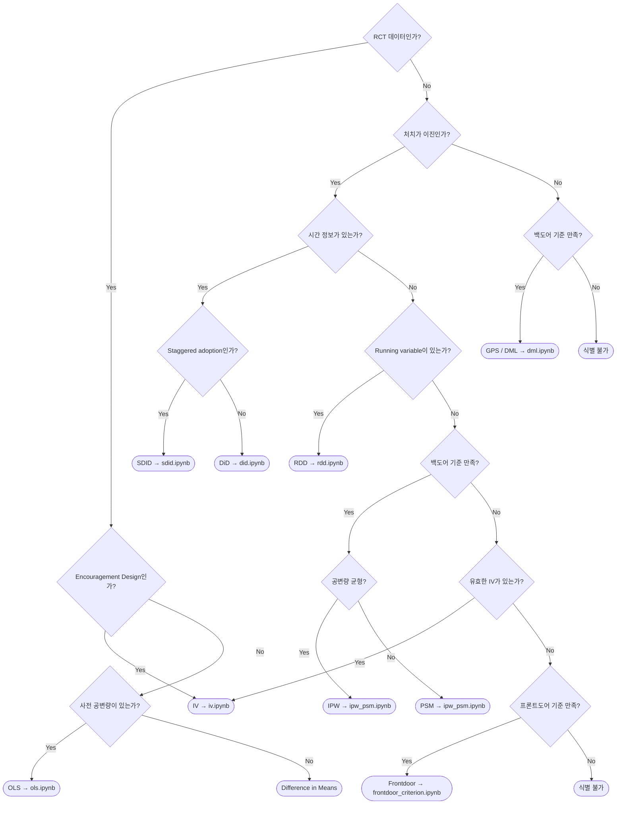

# Search Feature Design Document

## 개요

본 문서는 **인과추론 방법론 코드북**에 전역 검색 기능을 추가하기 위한 설계 문서이다.

### 목표

- 사용자가 **자신의 문제 설정에 맞는 인과추론 방법**을 탐색할 수 있도록 지원
- 단순 키워드 검색을 넘어, **의사결정 흐름 기반** 방법론 선택 지원
- 태그 기반 필터링으로 노트북 간 비교·탐색 용이

---

## 1. 태그 시스템 설계

### 1.1 태그의 목적

| 목적 | 설명 |
|------|------|
| **방법론 분류** | 어떤 인과추론 방법인가 |
| **추정 대상** | ATE / CATE / LATE 등 무엇을 추정하는가 |
| **데이터 요구사항** | 어떤 데이터 구조가 필요한가 |
| **핵심 가정** | 어떤 가정이 충족되어야 하는가 |
| **적용 맥락** | 언제 이 방법을 사용하는가 |

### 1.2 태그 카테고리 (Taxonomy)

#### Category 1: 추정 대상 (`estimand`)

| 태그 | 설명 |
|------|------|
| `ate` | Average Treatment Effect |
| `att` | Average Treatment Effect on the Treated |
| `late` | Local Average Treatment Effect |
| `cate` | Conditional Average Treatment Effect |
| `policy` | Policy Value / Optimal Policy |

#### Category 2: 방법론 유형 (`method`)

| 태그 | 설명 | Part |
|------|------|------|
| `regression` | OLS, Fixed Effects | Part 1 |
| `matching` | PSM, Nearest Neighbor | Part 1 |
| `weighting` | IPW, AIPW | Part 1 |
| `did` | Difference-in-Differences | Part 1 |
| `sc` | Synthetic Control | Part 1 |
| `rdd` | Regression Discontinuity | Part 1 |
| `iv` | Instrumental Variables | Part 1 |
| `dml` | Double Machine Learning | Part 2 |
| `meta-learner` | S/T/X/R-Learner | Part 2 |
| `causal-forest` | Causal Forest, GRF | Part 2 |
| `neural-net` | DragonNet, CEVAE | Part 2 |
| `causal-discovery` | LiNGAM, PC, GES | Part 2 |
| `msm` | Marginal Structural Models | Part 2 |

#### Category 3: 데이터 구조 (`data`)

| 태그 | 설명 |
|------|------|
| `cross-sectional` | 단일 시점 데이터 |
| `panel` | 동일 개체 반복 관측 |
| `time-series` | 시계열 집계 데이터 |
| `longitudinal` | 시변 처치 추적 데이터 |

#### Category 4: 처치 유형 (`treatment`)

| 태그 | 설명 |
|------|------|
| `binary` | 이진 처치 (0/1) |
| `continuous` | 연속 처치 (dose-response) |
| `time-varying` | 시변 처치 |

#### Category 5: 핵심 가정 (`assumption`)

| 태그 | 설명 |
|------|------|
| `unconfoundedness` | 비관측 교란 없음 |
| `overlap` | 공통 지지 / 양의 확률 |
| `parallel-trends` | 평행 추세 가정 |
| `exclusion` | 배제 제한 (IV) |
| `continuity` | 연속성 가정 (RDD) |
| `no-interference` | SUTVA / 단위 간 비간섭 |

#### Category 6: 식별 전략 (`identification`)

| 태그 | 설명 |
|------|------|
| `selection-on-observables` | 관측 변수 조건부 |
| `design-based` | 설계 기반 (RCT, RDD, IV) |
| `backdoor` | 백도어 기준 충족 |
| `frontdoor` | 프론트도어 기준 충족 |

### 1.3 태그 네이밍 규칙

```
[category]:[value]
```

**예시:**
- `estimand:ate`
- `method:did`
- `data:panel`
- `treatment:binary`
- `assumption:parallel-trends`

### 1.4 태그 Granularity

| 수준 | 적용 |
|------|------|
| **노트북 단위** | 모든 노트북에 필수 적용 |
| **섹션 단위** | Part 2의 변형 섹션에 선택 적용 |

### 1.5 노트북별 태그 할당

#### Part 1

| 노트북 | 태그 |
|--------|------|
| `ols.ipynb` | `estimand:ate`, `method:regression`, `data:panel`, `treatment:binary`, `assumption:unconfoundedness`, `identification:selection-on-observables` |
| `ipw_psm.ipynb` | `estimand:ate`, `method:weighting`, `method:matching`, `data:cross-sectional`, `treatment:binary`, `assumption:unconfoundedness`, `assumption:overlap` |
| `did.ipynb` | `estimand:ate`, `method:did`, `data:panel`, `treatment:binary`, `assumption:parallel-trends`, `identification:design-based` |
| `sc.ipynb` | `estimand:ate`, `method:sc`, `data:time-series`, `treatment:binary`, `assumption:parallel-trends` |
| `sdid.ipynb` | `estimand:ate`, `method:sc`, `method:did`, `data:panel`, `treatment:binary`, `assumption:parallel-trends` |
| `rdd.ipynb` | `estimand:late`, `method:rdd`, `data:cross-sectional`, `treatment:binary`, `assumption:continuity`, `identification:design-based` |
| `iv.ipynb` | `estimand:late`, `method:iv`, `data:cross-sectional`, `treatment:binary`, `assumption:exclusion`, `identification:design-based` |

#### Part 2

| 노트북 | 태그 |
|--------|------|
| `dml.ipynb` | `estimand:ate`, `estimand:cate`, `method:dml`, `data:cross-sectional`, `treatment:binary`, `assumption:unconfoundedness` |
| `meta_learner.ipynb` | `estimand:cate`, `method:meta-learner`, `data:cross-sectional`, `treatment:binary`, `assumption:unconfoundedness` |
| `cate_with_nn.ipynb` | `estimand:cate`, `method:neural-net`, `data:cross-sectional`, `treatment:binary` |
| `backdoor_criterion.ipynb` | `estimand:ate`, `method:regression`, `data:cross-sectional`, `treatment:binary`, `identification:backdoor` |
| `causal_discovery.ipynb` | `method:causal-discovery`, `data:cross-sectional` |
| `MSM.ipynb` | `estimand:ate`, `method:msm`, `data:longitudinal`, `treatment:time-varying`, `assumption:no-interference` |
| `policy_learning.ipynb` | `estimand:policy`, `method:causal-forest`, `data:cross-sectional`, `treatment:binary` |

#### Examples

| 노트북 | 태그 |
|--------|------|
| `frontdoor_criterion.ipynb` | `estimand:ate`, `data:cross-sectional`, `treatment:binary`, `identification:frontdoor` |
| `budget_constrained_optimization.ipynb` | `estimand:policy`, `method:meta-learner`, `data:cross-sectional`, `treatment:binary` |
| `fractional_uplift.ipynb` | `estimand:cate`, `method:meta-learner`, `data:cross-sectional`, `treatment:binary` |

---

## 2. 검색 아키텍처 설계

### 2.1 검색 방식 비교

| 방식 | 장점 | 단점 | 적합성 |
|------|------|------|--------|
| **태그 기반 필터링** | 구현 간단, 명확한 분류, 유지보수 용이 | 태그 정의 필요, 유연성 제한 | **높음** |
| **메타데이터 인덱싱** | Jupyter Book 내장 지원, 빠른 검색 | 복잡한 쿼리 어려움 | 중간 |
| **벡터 검색 (Embedding)** | 자연어 쿼리, 유사도 기반 | 구현 복잡, 외부 서비스 의존 | 낮음 |
| **하이브리드** | 태그 + 자연어 결합 | 복잡도 높음 | 향후 확장 |

### 2.2 권장 아키텍처: 태그 기반 + Decision Tree

**핵심 아이디어:** 사용자가 **질문에 답하며 점진적으로 방법론을 좁혀가는 구조**

```
┌─────────────────────────────────────────────────────────┐
│                    Method Finder                         │
│  "어떤 인과추론 방법을 사용해야 할까요?"                    │
├─────────────────────────────────────────────────────────┤
│  Q1. 무작위 실험(RCT) 데이터인가요?                        │
│      [예]  [아니오]                                       │
├─────────────────────────────────────────────────────────┤
│  Q2. 처치는 이진(binary)인가요?                           │
│      [예]  [아니오 (연속)]                                │
├─────────────────────────────────────────────────────────┤
│  Q3. 시간 정보가 있나요? (패널/시계열)                      │
│      [예]  [아니오]                                       │
├─────────────────────────────────────────────────────────┤
│  Q4. Running variable이 있나요? (cutoff 기반 할당)         │
│      [예 → RDD]  [아니오]                                 │
├─────────────────────────────────────────────────────────┤
│  Q5. 유효한 도구 변수가 있나요?                            │
│      [예 → IV]  [아니오]                                  │
├─────────────────────────────────────────────────────────┤
│  Q6. 백도어 기준이 만족되나요? (관측 교란 통제 가능)          │
│      [예]  [아니오]                                       │
│      └── 공변량 균형 여부                                  │
│          [균형 → IPW]  [불균형 → Matching]                │
└─────────────────────────────────────────────────────────┘
```

### 2.3 Decision Tree 로직



### 2.4 구현 방식

#### Option A: Jupyter Book Sphinx Extension (권장)

```yaml
# book/_config.yml 추가
sphinx:
  extra_extensions:
    - sphinx_tags  # 또는 custom extension
```

각 노트북 첫 셀에 메타데이터 추가:

```yaml
---
tags:
  - estimand:ate
  - method:did
  - data:panel
  - treatment:binary
  - assumption:parallel-trends
---
```

#### Option B: 별도 JSON 인덱스 파일

```json
// book/data/notebook_index.json
{
  "notebooks": [
    {
      "path": "part1/ols.ipynb",
      "title": "OLS + Fixed Effects",
      "estimand": ["ate"],
      "method": ["regression"],
      "data": ["panel"],
      "treatment": ["binary"],
      "assumptions": ["unconfoundedness"],
      "identification": ["selection-on-observables"]
    },
    ...
  ]
}
```

#### Option C: Interactive Decision Tree Page

`book/method_finder.md` 페이지 추가:

```markdown
# Method Finder

어떤 인과추론 방법을 사용해야 할지 모르겠나요?
아래 질문에 답하며 적절한 방법을 찾아보세요.

<div id="method-finder">
  <!-- JavaScript로 구현된 Interactive Decision Tree -->
</div>
```

### 2.5 권장 구현 전략

**Phase 1: 태그 시스템 + 정적 인덱스** (즉시 구현 가능)
- 각 노트북에 YAML 메타데이터로 태그 추가
- `_toc.yml`에 태그 정보 반영
- 태그별 필터링 페이지 생성

**Phase 2: Decision Tree 페이지** (단기)
- Method Finder 페이지 추가
- JavaScript 기반 인터랙티브 UI
- 선택 결과를 노트북 링크로 연결

**Phase 3: 검색 통합** (중기)
- Jupyter Book 검색과 태그 통합
- 자연어 쿼리 → 태그 매핑 (선택적)

---

## 3. CLAUDE.md 수정 제안

### 3.1 추가할 섹션: 태그 규칙

```markdown
---

## 7. 태그 시스템 (필수)

모든 노트북은 **첫 셀에 YAML 메타데이터로 태그를 명시**해야 한다.

### 태그 카테고리

| 카테고리 | 필수 여부 | 예시 |
|----------|----------|------|
| `estimand` | 필수 | `ate`, `cate`, `late`, `policy` |
| `method` | 필수 | `regression`, `did`, `dml`, `meta-learner` |
| `data` | 필수 | `cross-sectional`, `panel`, `longitudinal` |
| `treatment` | 필수 | `binary`, `continuous`, `time-varying` |
| `assumption` | 권장 | `unconfoundedness`, `parallel-trends` |
| `identification` | 권장 | `selection-on-observables`, `design-based`, `backdoor` |

### 태그 형식

노트북 첫 번째 마크다운 셀에 아래 형식으로 작성:

```yaml
---
tags:
  - estimand:ate
  - method:did
  - data:panel
  - treatment:binary
  - assumption:parallel-trends
---
```

### 태그 추가 시 주의사항

- 복수 태그 허용 (예: `method:sc`, `method:did` 동시 가능)
- 새로운 태그 추가 시 이 문서에 먼저 정의
- 기존 태그 네이밍 규칙 준수: `[category]:[value]`

---
```

### 3.2 기존 섹션 수정: 첫 셀 규칙 (3.3)

```markdown
### 3.3 첫 셀 규칙

모든 Notebook의 첫 셀은 아래 형식을 따른다.

```yaml
---
tags:
  - estimand:ate
  - method:regression
  - data:panel
  - treatment:binary
---
```

# Method Name
한국어 한 줄 설명

- Reference: (논문 / 교과서 링크)
```

---

## 4. 구현 로드맵

### Phase 1: 기반 구축 (1-2주)

- [ ] 모든 노트북에 태그 메타데이터 추가
- [ ] `book/data/notebook_index.json` 생성
- [ ] CLAUDE.md에 태그 규칙 추가

### Phase 2: 검색 UI 구현 (2-3주)

- [ ] Method Finder 페이지 (`book/method_finder.md`) 생성
- [ ] Decision Tree UI 구현 (JavaScript)
- [ ] 태그 기반 필터 페이지 추가

### Phase 3: 통합 및 개선 (3-4주)

- [ ] Jupyter Book 검색과 태그 연동
- [ ] 사용자 피드백 기반 Decision Tree 개선
- [ ] 태그 자동 검증 CI 추가

---

## 5. 향후 확장 가능성

### 5.1 자연어 검색

사용자 쿼리 예시:
- "패널 데이터에서 이진 처치 효과를 추정하고 싶어요"
- "도구 변수 없이 관측 데이터로 인과 효과를 추정할 수 있나요?"

→ LLM 기반 쿼리 → 태그 매핑으로 확장 가능

### 5.2 비교 기능

"DiD vs Synthetic Control 비교"와 같이 두 방법론을 나란히 비교하는 뷰 제공

### 5.3 사용자 맞춤 추천

사용자가 데이터 특성을 입력하면, 적합한 방법론을 순위화하여 추천

### 5.4 Reference 네트워크

각 방법론의 핵심 논문/교과서를 연결하여, 방법론 간 이론적 관계 시각화

---

## 부록: Decision Tree 참고 자료

본 설계는 아래 논문의 방법론 선택 decision tree를 벤치마킹하였다:

> **Causal AI Scientist: Facilitating Causal Data Science with Large Language Models**

핵심 질문 흐름:
1. Is this a randomized trial?
2. Is treatment binary?
3. Is temporal information available?
4. Is there a running variable?
5. Is there a valid backdoor adjustment set?
6. Is there a valid instrument?
7. Is frontdoor criterion satisfied?
